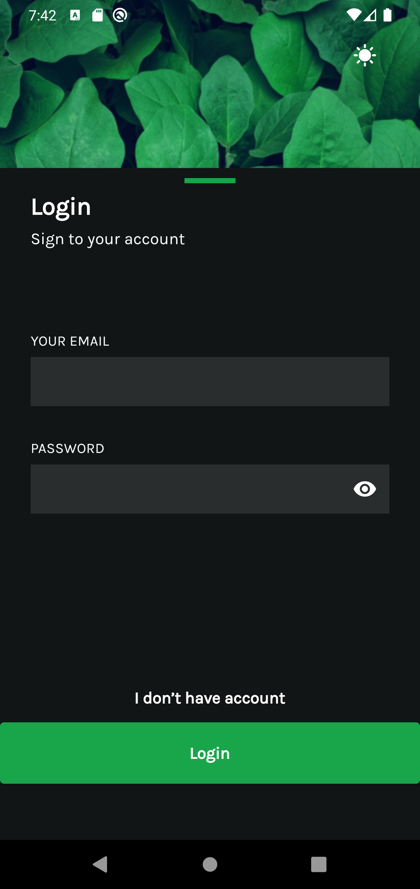
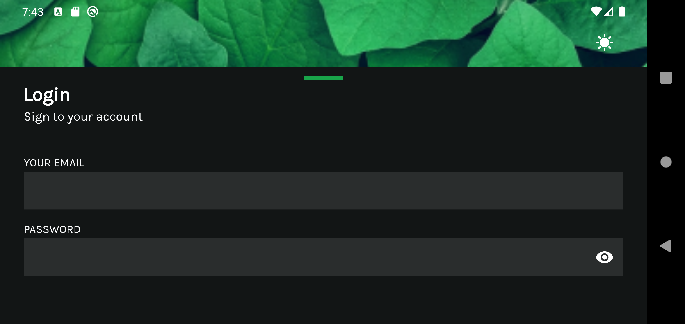

# form_challenge

[Design](https://www.figma.com/community/file/981854843744172490)
### Screenshots

<table>
   <thead>
      <tr>
         <th></th>
         <th></th>
      </tr>
   </thead>
   <tbody>
      <tr>
         <td></td>
         <td></td>
      </tr>
       <tr>
         <td></td>
         <td></td>
      </tr>
        <tr>
         <td></td>
      </tr>
   </tbody>
</table>